# GRID
[🌸 GRID GARDEN](https://cssgridgarden.com/#ko)

## ✔️ GRID를 사용해야하는 이유
Flexbox를 이용해서 3x2 화면을 그린다고 생각해보자. 아래처럼 정렬되는 형태를 얻게된다.

```css
.container{
  display: flex;
  flex-wrap: wrap;
  justify-content: space-between;
}

.child{
  flex-basis: 30%;
  background: peru;
  color: white;
}
```
```html
<div class="father">
  <div class="child">1</div>
  <div class="child">2</div>
  <div class="child">3</div>
  <div class="child">4</div>
  <div class="child">5</div>
</div>
```
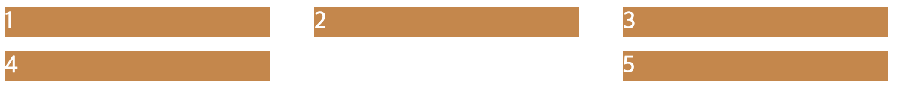

#### 즉, flexbox에서 좌우배치, 중앙배치는 쉽지만 grid형태를 만드는 것은 어렵다. 순차적으로 왼쪽 정렬되어 나열되는 grid 화면은 어떻게 그릴 수 있을까?

<br/>

## ✔️ Rule fo Grid
> Gird 속성은 container에서 정의된다.
> ```css
> .container{
>  display:grid;
> }
> ```


### 1) grid-container에서 row, column을 설정하는 방법

#### 🌸 **`grid-template-columns`**: grid column의 개수/넓이를 정의한다.

#### 🌸 **`grid-template-rows`**: grid row의 개수/넓이를 정의한다.

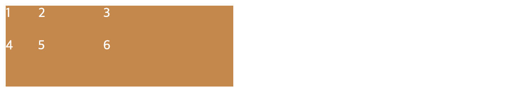

```css
.continer{
  display:grid;
  /* grid column 3개와 각 넓이를 지정한다. */
  grid-template-columns: 40px 80px 160px;
  /* grid row 2개와 각 넓이를 지정한다. */
  grid-template-rows: 40px 60px;
}
```
> `repeat(n, m)`: n개의 m크기의 column or row를 생성한다.
> - `grid-template-columns: repeat(3, 100px)`
> 
> `auto`: row or column의 여백을 남기지 않고 grid를 만든다. 즉, auto 영역은 container의 크기 변화에 반응하여 크기가 변경된다.
> - `grid-template-columns: auto 300px`

<br/>

### 2) grid 사이의 간격을 조절하는 방법

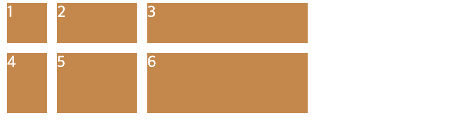

#### 🌸 **`column-gap`**: grid column 사이의 간격을 조절한다.
```css
.continer{
  display:grid;
  grid-template-columns: 40px 80px 160px;
  grid-template-rows: 40px 60px;
  /* grid column 사이의 간격 */
  column-gap:10px;
}
```

#### 🌸 **`row-gap`**: grid row 사이의 간격을 조절한다.
```css
.continer{
  display:grid;
  grid-template-columns: 40px 80px 160px;
  grid-template-rows: 40px 60px;
  /* grid row 사이의 간격 */
  row-gap:10px;
}
```

#### 🌸 **`gap`**: grid 사이의 간격을 조절한다.
- `gird: {row} {column};`: 각각 정의 가능

```css
.continer{
  display:grid;
  grid-template-columns: 40px 80px 160px;
  grid-template-rows: 40px 60px;
  /* grid row & column 사이의 간격 */
  gap:10px;
}
```

<br/>

### 3) grid로 템플릿 영역을 정의하자
#### 🌸 **`grid-template-areas`**: grid 템플릿 레이아웃을 정의한다.
- 줄마다 따옴표로 구분
- 사각형으로 이어진 영역에만 유효('ㄱ'로 이어진 영역엔 적용되지 않음)
- 비어있는 영역을 표기하고 싶을 땐 `.`을 사용한다.
  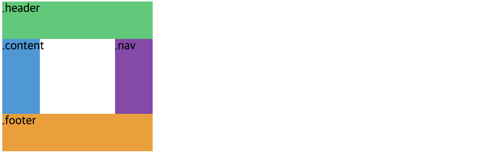

  ```css
  .continer{
    display: grid;
    grid-template-columns: repeat(4, 50px);
    grid-template-rows: repeat(4, 50px);
    grid-template-areas:
      "header header header header"
      "content . . nav"
      "content . . nav"
      "footer footer footer footer";
  }
  ```

#### 🌸 **`grid-area`**: grid 영역의 이름을 정의한다.
- 따옴표 사용하지 않음
- 클래스 이름과 별개

```css
.container{
  display: grid;
  grid-template-columns: repeat(4, 50px);
  grid-template-rows: repeat(4, 50px);
  grid-template-areas:
    "header header header header"
    "content content content nav"
    "content content content nav"
    "footer footer footer footer";
}

.header{
  background: #2ecc71;
  /* grid-area는 따옴표로 표시 안함 */
  grid-area: header;
}

.content{
  background: #3498db;
  grid-area: content;
}

.nav{
  background: #8e44ad;
  grid-area: nav;
}

.footer{
  background: #f39c12;
  grid-area: footer;
}
```
```html
<body>
  <div class="container">
      <div class="header">.header</div>
      <div class="content">.content</div>
      <div class="nav">.nav</div>
      <div class="footer">.footer</div>
  </div>
</body>
```
위 코드를 돌려보면 자동으로 grid 영역이 채워지는 것을 확인할 수 있다.


### 4) column과 row의 정렬 위치를 지정해서 정렬해보자.
> grid의 번호는 1부터 시작한다.

#### 🌸 **`grid-column-start: n`**: n번째 column에서 시작
#### 🌸 **`grid-column-end: m`**: m번째 column의 시작 이전(n-1번째)에서 끝남을 정의
- 즉, grid 엘리번트의 크기는 m-n이 된다.(n, m >= 1)

  ```css
  .container {
    display: grid;
    grid-template-columns: repeat(4, 50px);
    grid-template-rows: repeat(4, 50px);
  }

  .header {
    background: #2ecc71;
    grid-column-start: 1;
    grid-column-end: 3;
  }
  ```
  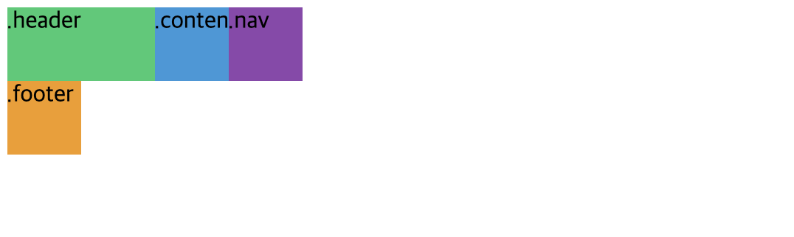

#### 🌸 **`grid-row-start: n`**: n번째 row에서 시작
#### 🌸 **`grid-row-end: m`**: m번째 row의 시작 이전(n-1번째)에서 끝남을 정의

#### `grid-template-areas`로 만든 레이아웃을 `grid-column-*`, `grid-row-*`를 이용해 정렬해보자!

```css
.header {
  background: #2ecc71;
  grid-column-start: 1;
  grid-column-end: 5;
}

.content {
  background: #3498db;
  grid-column-start: 1;
  grid-column-end: 4;
  grid-row-start: 2;
  grid-row-end: 4;
}

.nav {
  background: #8e44ad;
  grid-row-start: 2;
  grid-row-end: 4;
}

.footer {
  background: #f39c12;
  grid-column-start: 1;
  grid-column-end: 5;
}
```

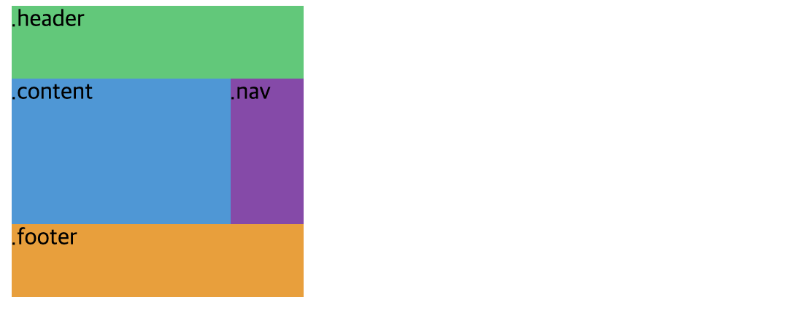

<br />

### [shortcut] 더 간단하게 column과 row의 정렬 위치를 지정해서 정렬해보자.
#### 🌸 **`grid-column: {start} / {end}`**: start ~ end 사이에 column을 차지한다.
#### 🌸 **`grid-row: {start} / {end}`**: start ~ end 사이에 row를 차지한다.
```css
.content {
  background: #3498db;
  grid-column: 1 / 4;
  grid-row: 2 / 4;
}
```

> #### 끝에서부터 line 세기
> 그리드는 앞에서부터 세면 1,2,3,4,... 순이지만 뒤에서부터 세면 -1, -2, -3,...도 가능하다.
> `grid-column: 1 / -2;` => [O,O,O,X]

> #### span 사용하기
> span은 비어있는 gird 영역부터 얼마나 더 채울지를 결정한다.
> `grid-column: span 3;` => [O,O,O,X]
> - span은 시작점이 명확할 때는 문제가 되지 안히만 불명확할 때 생각처럼 배열되지 않는다. 아래처럼 시작점을 써주자!
> `grid-column: {start} / span {cell count};`

```css
.header {
  background: #2ecc71;
  grid-column: 1 / -1;
}

.content {
  background: #3498db;
  grid-column: 1 / -2;
  /* grid-row: span 2; 시작점이 nav랑 겹쳐서 모양이 깨짐! */
  grid-row: 2 / span 2;
}

.nav {
  background: #8e44ad;
  grid-row-start: 2;
  grid-row-end: 4;
}

.footer {
  background: #f39c12;
  grid-column: span 4;
}
```

<br/>

### 5) fraction을 이용하여 grid 영역의 크기를 나눠보자!
#### 🌸 `fraction`: grid의 사용가능한 공간 전체를 사용하기 위한 단위이다.
```css
  .container {
    display: grid;
    grid-template-columns: repeat(4, 1fr);
  }
```


- `fraction`은 grid로 반응형 레이아웃을 그릴때 유용하다.
> ```css
> .container {
>   display: grid;
>   grid-template-columns: 4fr 1fr 1fr 1fr;
> }
> ```
> 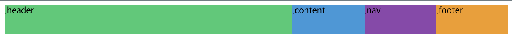


#### ※ grid의 높이를 지정하지 않으면 기본적으로 높이는 0이다. 만약 row에 fraction을 사용하게 되면, 사용가능한 높이 전체(0px)를 잡게되므로 grid 아이템이 화면에서 사라진다. 그러므로 row에 fraction을 쓰고 싶다면 반드시 grid container에 height를 설정해주자!

#### 🌸 `grid-template: "{gird-area}" {row size} / {column sizw}`
- 단 repeat함수는 사용할 수 없다.

```css
.container{
  display: grid;
  width: 50%;
  height: 10vh;
  grid-template:
    "header header header header" 1fr
    "content content content nav" 2fr
    "footer footer footer footer" 1fr / 1fr 1fr 1fr 1fr;
}

.header{
  background: #2ecc71;
  grid-area: header;
}

.content{
  background: #3498db;
  grid-area: content;
}

.nav{
  background: #8e44ad;
  grid-area: nav;
}

.nav{
  background: #f39c12;
  grid-area: footer;
}
```
```html
<body>
  <div class="container">
      <div class="header">.header</div>
      <div class="content">.content</div>
      <div class="nav">.nav</div>
      <div class="footer">.footer</div>
  </div>
</body>
```
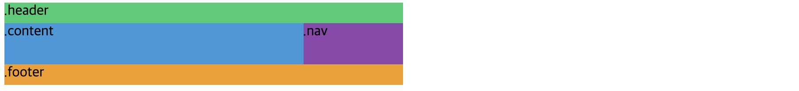

<br />

### 6) Place Items 속성을 이용하여 grid cell에서 각 grid item의 크기와 정렬을 지정해보자! 
#### 🌸 `justify-items`: gird cell에서 item의 **수평정렬**을 지정한다.
#### 🌸 `align-items`: gird cell에서 item의 **수직정렬**을 지정한다.
- stretch: gird cell영역에 가득 채운다.(기본값)
- start: grid cell 영역 시작점에 정렬
- end: grid cell영역 끝점에 정렬
- center: grid cell 영역 가운데 정렬


```css
.container{
  display: grid;
  width: 50%;
  height: 10vh;
  grid-template-columns: repeat(4, 1fr);
  grid-template-rows: repeat(2, 1fr);
  justify-items: start;
  align-items: end;
}
```
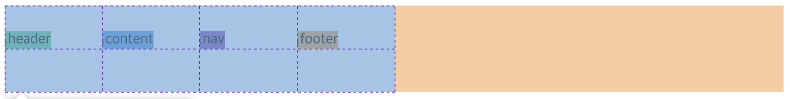

> [주의]grid item의 크기가 지정된 경우, stretch는 적용되지 않는다!
> ```css
> .container {
>   /* 윗부분 생략 */
>   justify-items: stretch;
>   align-items: stretch;
> }
> .container > div {
>   width: 50px;
>   height: 50px;
> }
> ```
> 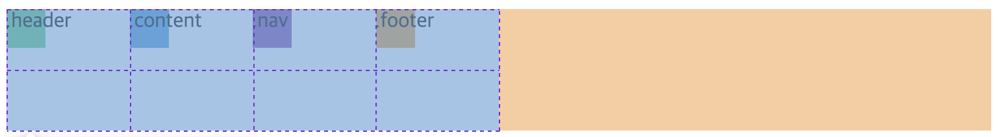

#### 🌸[Shortcut] `place-items: {align-items} {justify-items}`
```css
.container{
  /* 윗부분 생략 */
  place-items: start center;
}
```
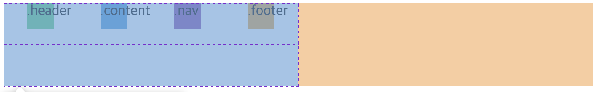

<br />

#### *Place Items가 grid cell 안의 item에 대한 속성이었다면, Place Content는 gird에 대한 속성을 정의한다.*

### 7) Place Content 속성을 이용하여 grid의 위치를 정의해보자
#### 🌸 `justify-content`: gird 자체의 **수평정렬**을 지정한다.
> 검정색 영역을 확인해보면 grid element(container) 자체의 크기는 변하지 않는다. 그 내부에 들어가는 grid의 위치만 조절하는 속성이다.
> ```css
> .container {
>   /* 윗부분 생략 */
>   justify-content: center;
>   background-color: black;
> }
> ```
> 

#### 🌸 `align-content`: gird 자체의 **수직정렬**을 지정한다.
- start: grid를 container의 시작점에 정렬
- end: grid를 container의 끝점에 정렬
- center: grid를 container의  가운데로 정렬
- space-between: grid 행/열 사이에 동일한 간격을 둠(양끝에 요소가 있음)
- space-around: grid 행/열 주위에 동일한 간격을 둠(양끝에 여백이 있음)

#### 🌸[Shortcut] `place-content: {align-content} {justify-content}`
```css
.container{
  display: grid;
  height: 30vh;
  grid-template-columns: repeat(4, 50px);
  grid-template-rows: repeat(4, 50px);
  place-content: center space-between;
  background-color: black;
}
```
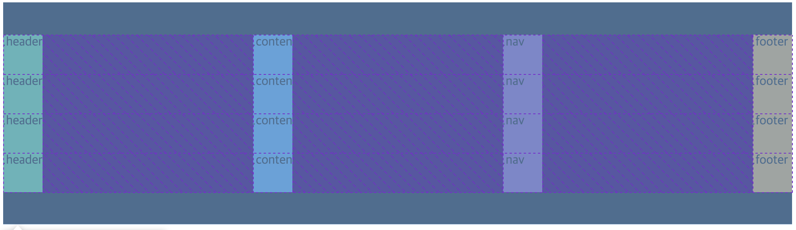

<br />

### 8) fraction을 사용했을때, 브라우저 크기가 작아지거나 커질때마 grid cell의 크기가 유동적으로 변한다. 최대로 커질 수 있는 값과 최소한 유지되어야하는 크기를 지정할 수 있을까?
#### 🌸 `minmax(min, max)`: 해당 grid cell은 maxr값보다 커질 수 없고 min보다 작아질 수 없다.
```css
.container{
  /* 윗부분 생략 */
  grid-template-columns: repeat(4, minmax(50px, 1fr)); /* 최소 100px, 최대 1fr */
}
```

<br>

### 9) repeat함수와 auto-fit, auto-fill을 이용하여 반응형 레이아웃을 만들어보자!
```css
.auto-fill{
  grid-template-columns: repeat(auto-fill, minmax(100px, 1fr));
}

.auto-fit{
  grid-template-columns: repeat(auto-fit, minmax(100px, 1fr));
}

.container{
  display: grid;
  gap: 5px;
}

.container > div {
  height: 50px;
}

.container > div:nth-child(2n-1){
  background: #2ecc71;
}
.container > div:nth-child(2n){
  background: #f39c12;
}
```
```html
auto-fill
<div class="auto-fill container">
  <div>1</div>
  <div>2</div>
  <div>3</div>
  <div>4</div>
</div>
auto-fit
<div class="auto-fit container">
  <div>1</div>
  <div>2</div>
  <div>3</div>
  <div>4</div>
</div>
```
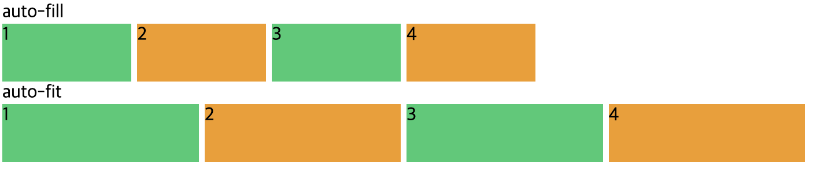

#### 🌸 `auto-fill`: 정해진 크기 n에 맞춰 가능한 많은 빈 column&row를 만든다.(빈공간을 동일한 크기n의 empty cell로 가득 채움)
- repeat(auto-fill, minmax(n, 1fr));
- grid cell의 개수를 정확하게 모르지만 모두 동일한 크기로 보여져야할 때 유용하게 사용가능하다. 
 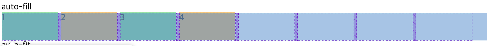

#### 🌸 `auto-fit`: grid 영역에 맞춰서 현재 cell의 크기를 늘려준다.
- repeat(auto-fit, minmax(n, 1fr));
- 화면 크기에 맞춰서 반응하므로, 반응형에서 가장 많이 사용된다.
 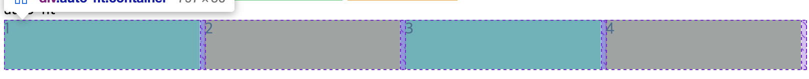

<br/>

### 10) min-content, max-content를 사용해보자!
#### 🌸 `min-content`: content의 크기를 줄여서 가능한 가장 작은 cell을 만든다.
- 즉, content(글자,여백 등)가 없다면 해당 cell의 크기는 0으로 화면에 보이지 않음
- 글자가 줄바꿈 됨

#### 🌸 `max-content`: content의 크기 만큼 cell을 늘린다.
- 글자가 줄바꿈처리되지 않음. 줄바꿈이 나올때까지 늘어남

```css
.grid{
  display: grid;
  gap: 5px;
  grid-template-columns: max-content min-content;
  grid-auto-rows: 100px;
}

.grid > div:nth-child(2n-1){
  background: #2ecc71;
}
.grid > div:nth-child(2n){
  background: #f39c12;
}
```
```html
<div class="grid">
  <div class="item">This is a very long text</div>
  <div class="item">This is a very long text</div>
</div>
```


<br/>


#### [활용] max-content와 repeat, minmax 활용하기
```html
<div class="grid">
  <div class="item">This is a very long text</div>
  <div class="item">This is a very longer longer long text</div>
  <div class="item">This is a text</div>
  <div class="item">Not long at all, or maybe, who...</div>
  <div class="item">This is a very longer long text</div>
</div>
```
```css
.grid{
  display: grid;
  gap: 5px;
  grid-template-columns: repeat(5, minmax(max-content, 1fr));
  grid-auto-rows: 100px;
}
```
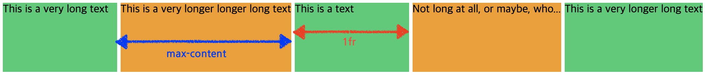

