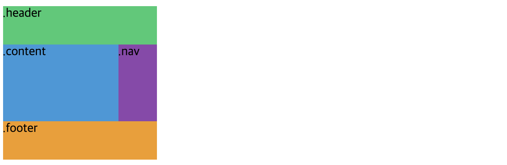

# GRID

## ✔️ GRID를 사용해야하는 이유
Flexbox를 이용해서 3x2 화면을 그린다고 생각해보자. 아래처럼 정렬되는 형태를 얻게된다.

```css
.container{
  display: flex;
  flex-wrap: wrap;
  justify-content: space-between;
}

.child{
  flex-basis: 30%;
  background: peru;
  color: white;
}
```
```html
<div class="father">
  <div class="child">1</div>
  <div class="child">2</div>
  <div class="child">3</div>
  <div class="child">4</div>
  <div class="child">5</div>
</div>
```


#### 즉, flexbox에서 좌우배치, 중앙배치는 쉽지만 grid형태를 만드는 것은 어렵다. 순차적으로 왼쪽 정렬되어 나열되는 grid 화면은 어떻게 그릴 수 있을까?

<br/>

## ✔️ Rule fo Grid
> Gird 속성은 container에서 정의된다.
> ```css
> .container{
>  display:grid;
> }
> ```


### 1) grid-container에서 row, column을 설정하는 방법

#### ⭐️ **`grid-template-columns`**: grid column의 개수/넓이를 정의한다.

#### ⭐️ **`grid-template-rows`**: grid row의 개수/넓이를 정의한다.

> 

```css
.continer{
  display:grid;
  /* grid column 3개와 각 넓이를 지정한다. */
  grid-template-columns: 40px 80px 160px;
  /* grid row 2개와 각 넓이를 지정한다. */
  grid-template-rows: 40px 60px;
}
```
> `repeat(n, m)`: n개의 m크기의 column or row를 생성한다.
> - `grid-template-columns: repeat(3, 100px)`

<br/>

### 2) grid 사이의 간격을 조절하는 방법

> 

#### ⭐️ **`column-gap`**: grid column 사이의 간격을 조절한다.
```css
.continer{
  display:grid;
  grid-template-columns: 40px 80px 160px;
  grid-template-rows: 40px 60px;
  /* grid column 사이의 간격 */
  column-gap:10px;
}
```

#### ⭐️ **`row-gap`**: grid row 사이의 간격을 조절한다.
```css
.continer{
  display:grid;
  grid-template-columns: 40px 80px 160px;
  grid-template-rows: 40px 60px;
  /* grid row 사이의 간격 */
  row-gap:10px;
}
```

#### ⭐️ **`gap`**: grid 사이의 간격을 조절한다.
- `gird: {row} {column};`: 각각 정의 가능

```css
.continer{
  display:grid;
  grid-template-columns: 40px 80px 160px;
  grid-template-rows: 40px 60px;
  /* grid row & column 사이의 간격 */
  gap:10px;
}
```

<br/>

### 3) grid로 템플릿 영역을 정의하자
#### ⭐️ **`grid-template-areas`**: grid 템픞릿 레이아웃을 정의한다.
- 줄마다 따옴표로 구분
- 사각형으로 이어진 영역에만 유효('ㄱ'로 이어진 영역엔 적용되지 않음)
- 비어있는 영역을 표기하고 싶을 땐 `.`을 사용한다.
  ```css
  .continer{
    display: grid;
    grid-template-columns: repeat(4, 50px);
    grid-template-rows: repeat(4, 50px);
    grid-template-areas:
      "header header header header"
      "content . . nav"
      "content . . nav"
      "footer footer footer footer";
  }
  ```

#### ⭐️ **`grid-area`**: grid 영역의 이름을 정의한다.
- 따옴표 사용하지 않음
- 클래스 이름과 별개

```css
.continer{
  display: grid;
  grid-template-columns: repeat(4, 50px);
  grid-template-rows: repeat(4, 50px);
  grid-template-areas:
    "header header header header"
    "content content content nav"
    "content content content nav"
    "footer footer footer footer";
}

.header{
  background: #2ecc71;
  /* grid-area는 따옴표로 표시 안함 */
  grid-area: header;
}

.content{
  background: #3498db;
  grid-area: content;
}

.nav{
  background: #8e44ad;
  grid-area: nav;
}

.nav{
  background: #f39c12;
  grid-area: footer;
}
```
```html
<body>
  <div class="container">
      <div class="header">.header</div>
      <div class="content">.content</div>
      <div class="nav">.nav</div>
      <div class="footer">.footer</div>
  </div>
</body>
```
위 코드를 돌려보면 자동으로 grid 영역이 채워지는 것을 확인할 수 있다.

> 
